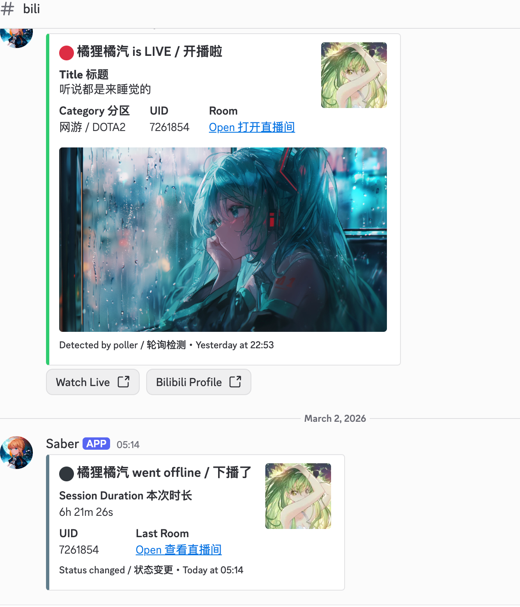
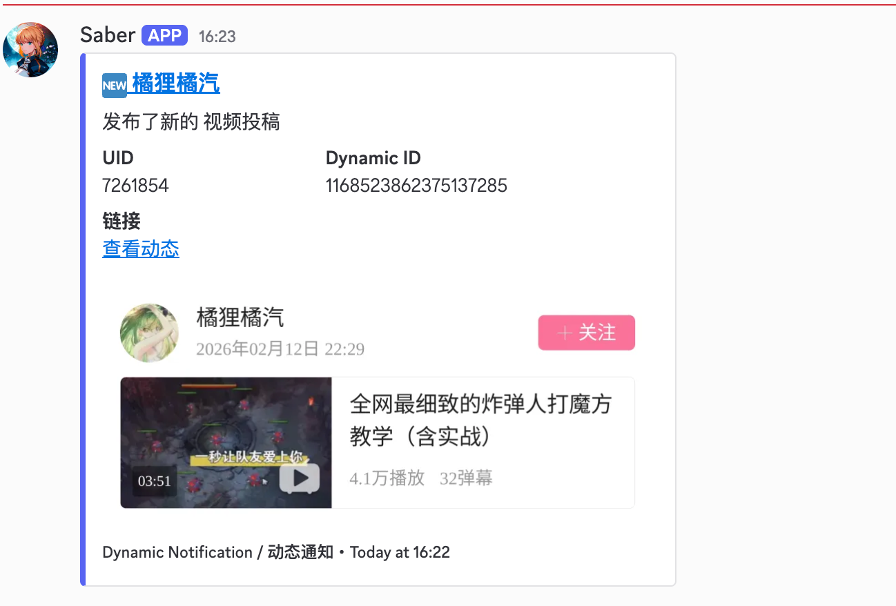

# Discord Live Bot (Bilibili)






Discord bot subproject for tracking Bilibili live status with slash commands, rich embeds, and link buttons.

## Features

- Slash commands: `/subscribe`, `/unsubscribe`, `/list`, `/live`, `/help`
- Test command: `/test_dynamic_push` to send a real dynamic preview immediately
- `/unsubscribe` supports UID autocomplete from current subscriptions
- Rich Discord embeds for live/offline transitions
- URL buttons (`Watch Live`, `Bilibili Profile`)
- SQLite subscription storage
- Experimental dynamic notifications (best-effort, skipped on fetch failure)
- Direct Bilibili API via `httpx` with normalized image URLs

## Requirements

- `uv`
- Discord bot token with application command permission

## Quick Start

```bash
cd discord_live_bot
cp .env.example .env
# fill values in .env
uv sync
uv run discord-live-bot
```

## Docker Deploy

Build and run directly:

```bash
cd discord_live_bot
docker build -t discord-live-bot:slimcheck .
docker run -d \
  --name discord-live-bot \
  --restart unless-stopped \
  --env-file .env \
  -v "$(pwd)/data:/app/data" \
  discord-live-bot:slimcheck
```

Image size notes for Linux x86_64:
- Default build includes Playwright browser screenshot runtime and CJK fonts for Chinese text rendering (larger image).
- To build a lighter image (disable browser screenshot runtime in image):

```bash
docker build --build-arg INSTALL_PLAYWRIGHT=0 -t discord-live-bot:lite .
```

When using lite image, set:

```bash
BILI_DYNAMIC_BROWSER_SCREENSHOT_ENABLED=false
```

Or use Compose:

```bash
cd discord_live_bot
docker compose up -d --build
```

Check logs:

```bash
docker logs -f discord-live-bot
```

## Linux x86_64 Tar Deploy (Recommended for your server)

Build a Linux `amd64` image tarball on your machine:

```bash
cd discord_live_bot
chmod +x scripts/build_linux_amd64_tar.sh scripts/deploy_from_tar.sh
./scripts/build_linux_amd64_tar.sh
```

This creates:

- `dist/discord-live-bot_slimcheck_linux_amd64.tar.gz`

Upload to server:

1. Upload the tarball (and `scripts/deploy_from_tar.sh`) to your Linux server.
2. Put your `.env` on the server.
3. Run deploy script on server:

```bash
chmod +x scripts/deploy_from_tar.sh
./scripts/deploy_from_tar.sh dist/discord-live-bot_slimcheck_linux_amd64.tar.gz .env
```

Run in background is automatic (`docker run -d` + `--restart unless-stopped`).

If you saw `sqlite3.OperationalError: unable to open database file` on server:

- It is usually a bind-mount permission issue (`/app/data` not writable by container user).
- `scripts/deploy_from_tar.sh` now auto-fixes ownership before starting the container.
- Manual recovery (if needed):

```bash
chown -R 100:101 /opt/discord-live-bot/data
```

If you saw `ClientConnectorDNSError` for `discord.com:443`:

- This is usually Docker bridge networking/DNS on the server, not Python TLS libraries.
- Preferred fix on Linux server: use host networking in `deploy/server.conf`:

```bash
DOCKER_NETWORK_MODE=host
```

- If running `docker run` manually, add:

```bash
--network host
```

- If you must keep bridge mode, set DNS override in `deploy/server.conf`:

```bash
DOCKER_DNS=1.1.1.1,8.8.8.8
```

Deploy script behavior:
- Passes `DOCKER_NETWORK_MODE` as `docker run --network ...`
- Passes `DOCKER_DNS` as `--dns ...` only when network mode is not `host`

## One-Command SSH Deploy (Build + Upload + Run)

This is the easiest flow if you want to include SSH user/host once and just run one command.

```bash
cd discord_live_bot
cp deploy/server.conf.example deploy/server.conf
# edit deploy/server.conf: SSH_USER / SSH_HOST / paths
chmod +x scripts/remote_deploy_via_ssh.sh scripts/build_linux_amd64_tar.sh scripts/deploy_from_tar.sh
./scripts/remote_deploy_via_ssh.sh
```

Default upload method is `rsync` (usually faster and resumable).
Default network mode in `deploy/server.conf.example` is `host` (Linux-friendly for DNS reliability).

To force `scp`, set this in `deploy/server.conf`:

```bash
UPLOAD_METHOD=scp
```

If server-side `rsync` is missing, the script automatically falls back to `scp`.
Install `rsync` on server for best speed:

```bash
# Debian/Ubuntu
apt-get update && apt-get install -y rsync
```

For faster upload with `rclone`, set this in `deploy/server.conf`:

```bash
UPLOAD_METHOD=rclone
```

Then run the same command:

```bash
./scripts/remote_deploy_via_ssh.sh
```

Notes for `rclone` mode:

- You can leave `RCLONE_REMOTE` empty. Script will use inline SFTP backend with `SSH_USER`/`SSH_HOST`/`SSH_PORT` (works with Tailscale hostnames).
- If you already configured an `rclone` remote, set `RCLONE_REMOTE=myremote`.

You can also pass a custom config path:

```bash
./scripts/remote_deploy_via_ssh.sh /path/to/server.conf
```

## Environment Variables

- `DISCORD_TOKEN`: Bot token
- `DISCORD_NOTIFY_CHANNEL_ID`: Channel to push live/offline notifications
- `DISCORD_GUILD_ID`: Optional guild id for faster command sync during development
- `POLL_INTERVAL_SECONDS`: Polling interval, default `30`
- `BILI_DYNAMIC_ENABLED`: Enable dynamic notifications, default `false`
- `BILI_DYNAMIC_POLL_INTERVAL_SECONDS`: Dynamic polling interval, default `60`, minimum `20`
- `BILI_DYNAMIC_REQUEST_GAP_SECONDS`: Delay between UID dynamic requests, default `3`
- `BILI_DYNAMIC_SCREENSHOT_ENABLED`: Enable screenshot/cover image on dynamic cards, default `true`
- `BILI_DYNAMIC_BROWSER_SCREENSHOT_ENABLED`: Prefer real browser screenshot capture, default `true`
- `BILI_DYNAMIC_BROWSER_TIMEOUT_SECONDS`: Browser screenshot timeout, default `25`
- `BILI_DYNAMIC_BROWSER_UA`: Browser UA for dynamic page rendering
- `BILI_DYNAMIC_CAPTCHA_ADDRESS`: Optional captcha solver server address (Haruka style)
- `BILI_DYNAMIC_CAPTCHA_TOKEN`: Optional captcha solver token
- `BILI_DYNAMIC_SCREENSHOT_TEMPLATE`: Fallback screenshot URL template when browser capture is unavailable
- `SQLITE_PATH`: SQLite file path, default `data/subscriptions.db`
- `LOG_LEVEL`: `DEBUG`/`INFO`/`WARNING`/`ERROR`

### Screenshot Prerequisite (Local Non-Docker)

Browser screenshot requires Playwright Chromium runtime:

```bash
uv run playwright install chromium
```

Docker image already installs Chromium and required runtime libraries at build time, so no extra Playwright install step is needed inside container.

Optional captcha solving (Haruka-style) can be enabled by installing solver package manually:

```bash
uv add aunly-captcha-solver
```

## Discord Permissions

- `View Channels`
- `Send Messages`
- `Embed Links`
- `Use Slash Commands`
